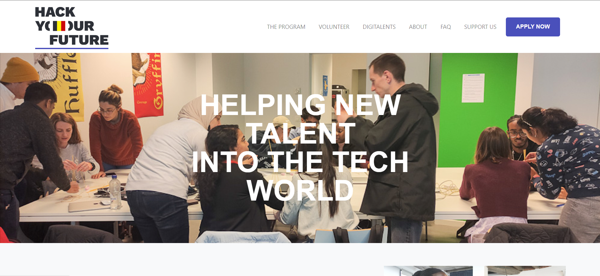

# HackYourFuture Redesign

> HackYourFuture :HYF: is a free 9-month web development program who helping new
> talent into the tech world.:computerrage:  
> This project consists of creating a better HYF home page than
> [existing one.](https://hackyourfuture.be/)

## Table of contents

- [HackYourFuture Redesign](#hackyourfuture-redesign)
  - [Table of contents](#table-of-contents)
  - [General info](#general-info)
  - [Screenshots](#screenshots)
  - [Technologies](#technologies)
  - [Setup](#setup)
  - [Code Examples](#code-examples)
  - [Features](#features)
  - [Status](#status)
  - [Inspiration](#inspiration)
  - [Team](#team)

## General info

> In this project our first priority is to build our own home page for
> HackYourFuture Belgium by using BEM/Bootstrap 5 ans and making design
> responsive.
>
> Our seconde priority is to work on other pages of the site in order to create
> a full-fledged website that meets all the needs of its users.

## Screenshots

## Technologies

- Bootstrap
- CSS
- Excalidraw
- HTML
- VSCode

## Setup

- `npm run start`

## Code Examples

## Features

List of features ready and To do's for future development

To-do list:

- [x] Logo
- [x] Navbar
- [x] Intro
- [x] Impact
- [ ] Mission & Vision
- [ ] Success stories
- [x] Support us
- [ ] Partners
- [ ] Footer with contacts

## Status

Project is: _in progress_

## Inspiration

Project by <https://hackyourfuture.be>

## Team

- [FennyWilriani](https://github.com/FennyWilriani)
- [MMikhailova](https://github.com/MMikhailova)
- [kiishiakande](https://github.com/kiishiakande)
- [Ufitamahoro](https://github.com/Ufitamahoro)
- [andriivam](https://github.com/andriivam)
- [zerubabel4](https://github.com/zerubabel4)
